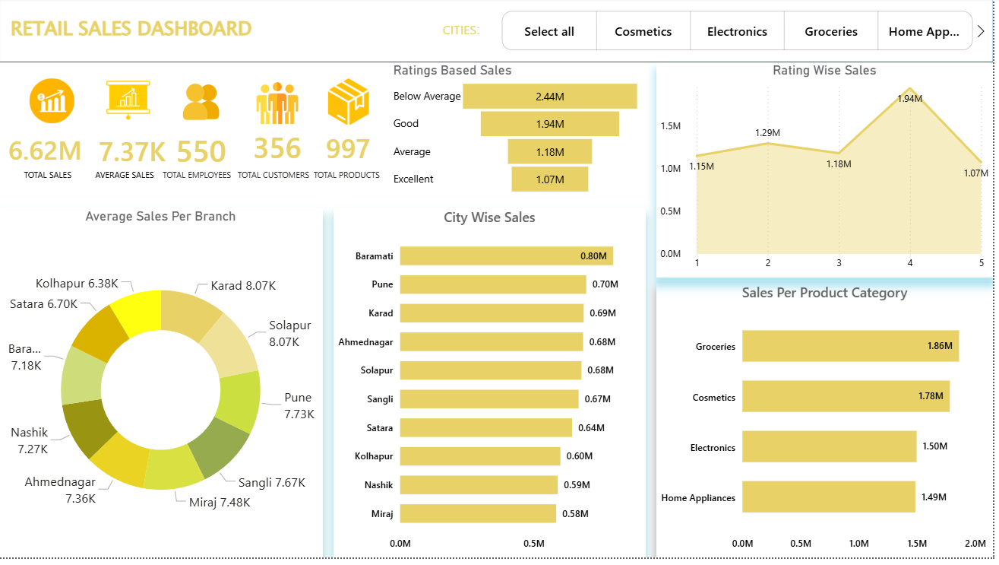
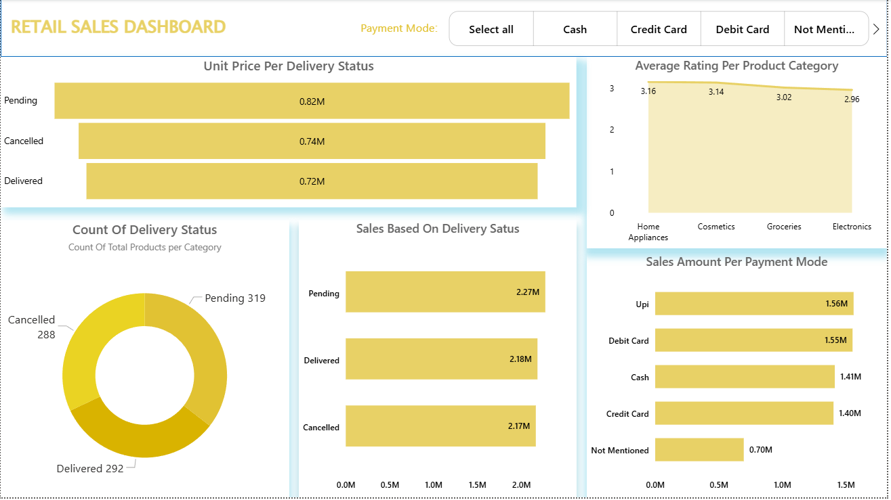
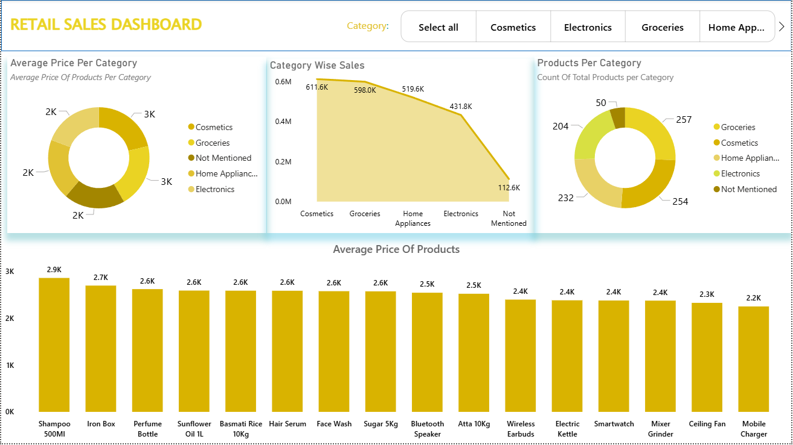
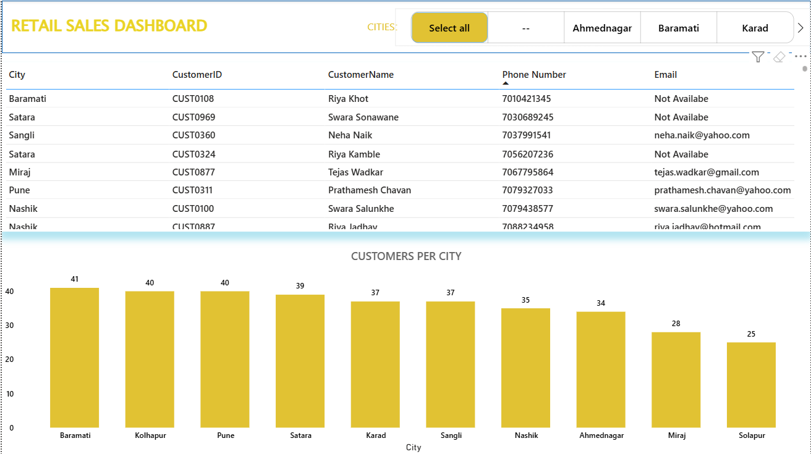
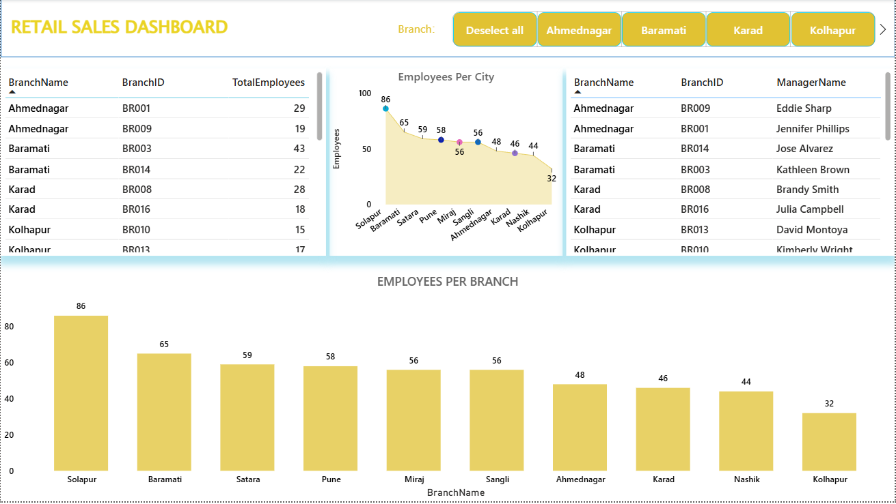

# Retail Sales Analytics Dashboard

## 📌 Overview
Retail sales analysis across cities, branches, products & customers using **Power Query, Excel & Power BI**.

## 🛠 Tools
Power Query • Excel • Power BI

## 📊 Key Features
- City & branch sales  
- Product category trends  
- Payment method analysis  
- Employee & customer distribution  

## 🏷 KPIs
Total Sales • Avg Sales • Products Sold • Avg Rating • Total Customers • Total Employees

## 🖼 Dashboard Screenshots

### ⭐ Sales Summary Dashboard  

### ⭐ Excel Summary Dashboard  

### ⭐ Payment Insights  

### ⭐ Product Performance  

### ⭐ Customers Overview  

### ⭐ Employees Overview  

### ⭐ Avg Branch Sales Tooltip  

### ⭐ Avg Price Tooltip  

### ⭐ City Average Sales Tooltip  

---

## 🔍 Insights
- Total sales: **6.62M**  
- Average sale: **7.37K**  
- Total customers: **356**  
- Total products sold: **997**  
- Total employees: **550**  
- **Groceries** had the highest sales  
- **Baramati** leading city in total sales  
- **UPI & Debit Card** most used payment methods  
- Pending deliveries were the highest  

---

## 📌 Summary
A complete retail analytics solution with professional ETL workflow and interactive dashboarding to help businesses track performance, revenue, customer behavior, and product insights across multiple cities.