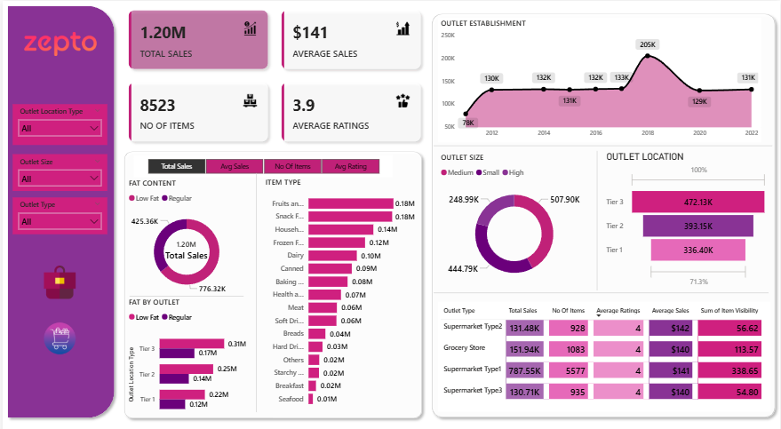

# Zepto Grocery Store Analysis

## 📌 Overview
End-to-end analysis of **online grocery sales dataset (Zepto-style)** using Excel, Power Query and Power BI.  
The project explores customer spending patterns, product performance, outlet segmentation, and sales insights.

Inspired by public learning/tutorial dashboards and built for BI practice.

---

## 🛠 Tools Used
- **Power Query** — Cleaning, transformations  
- **Excel** — KPI calculations & summaries  
- **Power BI** — Dashboards, KPIs, visual insights  

---

## 🛑 Dataset Overview
- **Rows:** 8524  
- **Columns:** 12  
- **Source:** Public Online Grocery Dataset  
- **Tools Used:** Excel, Power BI, Power Query  

---

## 🏷 KPIs
- Total Sales  
- Average Sales  
- Total Items  
- Average Rating  
- Total Orders  
- Avg Spend per Customer  
- Avg Item Weight  

---

## 🖼 Dashboard Screenshots

### ⭐ Spending Dashboard  

### ⭐ Excel Dashboard  

### ⭐ Summary Page  

---

## 🔍 Insights
- Total sales: **1.20M+**  
- Average sale: **141**  
- Items sold: **8523**  
- Average rating: **3.9**  
- Total orders: **~9000**  
- Avg spend per customer: **₹770.80**  
- Avg item weight: **13**  
- High outlet size & Tier 3 outlets show highest sales  
- Low-fat food category performs better than regular  
- Supermarket Type 1 outlet generated the most revenue  
- Average rating across outlet types ~4  

---

## 📌 Summary
This project delivers clean, interactive grocery business insights via **ETL + Power BI**, highlighting customer behavior, outlet performance, product trends, and spending patterns—ideal for operational decision-making.
